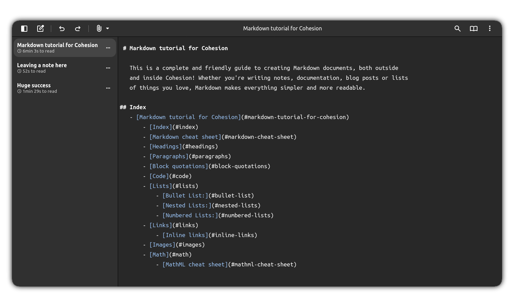

# Cohesion

[Launch Cohesion](https://flarom.github.io/cohesion/)

***

Cohesion is a free and opensource markdown editor that features:
- Syntax Highlighted text editor
- Markdown Live preview
- Multiple document support
- Keyboard / Mobile friendly interface
- Summary generator
- Table generator

All in your browser!

***
## About
Cohesion is heavily inspired by the [Apostrophe](https://apps.gnome.org/en/Apostrophe/) text editor, by [Manuel Genovés](https://gitlab.gnome.org/somas), but built for a web environment and with extra features! It uses [CodeMirror 5](https://codemirror.net/) to render syntax highlighting and [Showdownjs](https://showdownjs.com/) to parse Markdown.

## Useful resources
- [Cohesion Markdown Tutorial](https://flarom.github.io/cohesion/read.html?path=tutorial.md)
- [GitHub Markdown Guide](https://docs.github.com/articles/markdown-basics)
